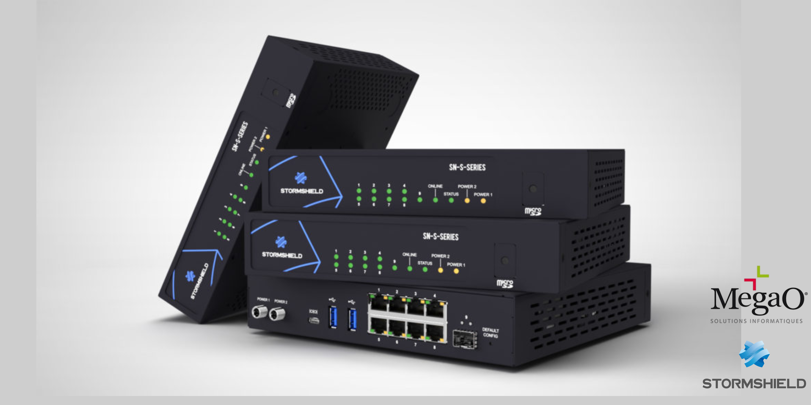

# 🛡️ **Découverte de Stormshield : Montage d’un pare‑feu**



## 📄 **Description**
Ce document présente le compte rendu détaillé du montage et de la configuration d’un pare‑feu Stormshield SN S Series 220 (version 4.3.17). Il couvre l’installation physique et virtuelle, l’activation de la licence, la configuration système, la mise en place de la politique de sécurité, et les principaux services réseau.
---
## 📚 **Qu’est‑ce que Stormshield ?**

**Stormshield** st un firewall UTM (Unified Threat Management) offrant :

- **Filtrage et inspection de trafic (IPS, SSL, HTTP, DNS)**.
- **Gestion avancée du NAT et routage**.
- **VPN site‑à‑site (IPsec) et VPN SSL**.
- **Services DHCP, DNS dynamique, proxy cache DNS**.
- **Qualité de service (QoS) et gestion des priorités**.
- **Administration via interface web sécurisée (accès restreint par adresse IP)**.
  
### 🔗 **Fonctionnalités Principales de Cisco Packet Tracer**

- **Filtrage** : règles source/destination/ports, inspection IPS.  
- **NAT** : traduction d’adresse sortante via interface FTTO.  
- **SSL/URL** : bypass et blocage de catégories (SSL_BLOCK, authentication_bypass).  
- **SMTP** : filtrage mail pour domaines spécifiés.  
- **QoS** : Class-Based Queuing (CBQ_1, 1 Mbit/s).  
- **Règles implicites** : accès WebAdmin, DNS, VPN, DHCP.  


---

## 📂 **Structure du Dépôt**

```
📂 decouverte-packet-tracer/
|
├── 📂 Documents/
│   └── stormshield_VIALETTE_Candice.pdf
│
├── 📂 image/
│   └── background.png
|
└── README.md
```
---

## 🚀 **Mise en Œuvre**

### 1. **Cloner le Dépôt**

```bash
git clone https://github.com/votre_nom_utilisateur/packet-tracer-atelier.git
cd packet-tracer-atelier
```

### 2. **Parcourir la Documentation**

Consultez le dossier `documentation/` pour des guides d'analyse détaillés.

---

## 💡 **Bonnes Pratiques**

- Sauvegarder automatiquement avant mise à jour.  
- Restreindre l’accès administration à adresses IP fiables.  
- Tester le ping/HTTPS après chaque étape critique.  
- Documenter les topologies et règles avec des annotations.  
---

## 📚 **Ressources Utiles**

- [Stormshield Network Security](https://www.stormshield.com/fr/produits/sns)  
- [Documentation Stormshield](https://documentation.stormshield.eu)  

---

## 🌍 **Licence**

Ce projet est sous licence MIT. Consultez le fichier [LICENSE](LICENSE) pour plus d'informations.

---

### 🗓 **Date de Création**
MAi 2025 
